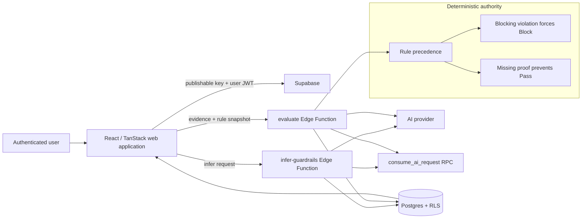

# Architecture

## Authority split

| Concern | Authority |
|---|---|
| User identity | Supabase Auth |
| Row access | Postgres RLS |
| Quota consumption | Server-side database function |
| Semantic interpretation | AI provider through Edge Functions |
| Final precedence | Deterministic evaluation code |
| Audit history | Server-authored immutable evaluation rows |

The AI may interpret evidence, but it cannot override a violated blocking rule or convert absent evidence into `Pass`.
