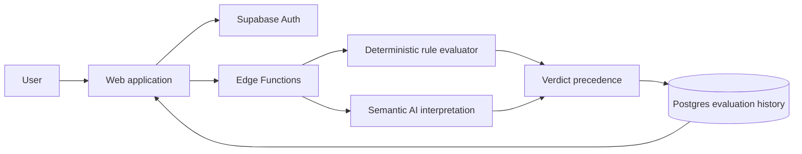

# DriftGuard case study

## 1. Problem

Consequential work often fails through constraint drift rather than total misunderstanding. The original purpose is known, but individual outputs gradually violate requirements, omit evidence, or weaken a non-negotiable rule. Existing review is usually late, memory-dependent, and inconsistent.

## 2. User and context

DriftGuard is designed for technical leads, product owners, consultants, and operators who must review work against explicit requirements before it is accepted, shipped, or used as the basis for another decision.

The current repository demonstrates the product and engineering system. It does not yet claim a completed external pilot or production adoption.

## 3. Existing workflow

1. Requirements are distributed across documents, tickets, and discussion.
2. A reviewer reconstructs the relevant constraints manually.
3. Structured and semantic requirements are mixed together.
4. Reviewers apply different interpretations or overlook missing evidence.
5. The output is accepted, revised, or blocked without a durable record of the exact policy snapshot used.

## 4. Constraints

- The user must retain ownership of purpose and guardrails.
- Missing evidence must never be treated as compliance.
- A model must not override explicit blocking rules.
- Every cloud verdict must be traceable to the exact accepted constraint set.
- Credentials, model access, and privileged writes must remain server-side.
- The product must remain useful when cloud services are unavailable without misrepresenting fallback output.

## 5. Product response

DriftGuard converts an accepted constraint set plus supplied evidence into one of three bounded verdicts:

- `Pass`: every active rule is met.
- `Watch`: at least one rule is unclear or non-blocking evidence is unresolved.
- `Block`: a violated blocking rule is present.

It also returns the smallest correction for the highest-priority unresolved rule.

## 6. Core workflow

1. The user enters purpose, workflow, target, and observable proof.
2. AI may propose guardrails, but the user must accept or edit them.
3. The user submits work and evidence for evaluation.
4. Binary, threshold, and checklist rules are evaluated deterministically.
5. AI interprets only semantic evidence.
6. Deterministic precedence converts findings into the final verdict.
7. Authenticated cloud evaluations are written with the complete constraint snapshot.

## 7. Architecture

Trust boundaries:

- Browser: public Supabase configuration, user input, and read access to owner-scoped records.
- Edge Functions: token verification, model credentials, quotas, validation, evaluation, and privileged history writes.
- Postgres: RLS-protected user data and immutable evaluation snapshots.

## 8. Important decisions

### Deterministic enforcement owns the final verdict

A model may classify semantic evidence, but it cannot weaken a blocking rule or convert missing proof into a pass. This increases predictability at the cost of refusing some ambiguous cases.

### Missing evidence becomes `Watch`

The system chooses conservative uncertainty rather than optimistic completion. This may create additional review work, but avoids false assurance.

### User acceptance precedes guardrail use

AI-generated guardrails are proposals only. This prevents silent policy creation but adds an explicit confirmation step.

### Local fallback is labelled `rules-preview`

The product remains demonstrable without cloud services, but local fallback output is not represented as cloud-audited AI evaluation.

### Evaluation history is server-authored

The browser cannot write or alter evaluation records. This adds backend complexity but preserves audit integrity.

## 9. Evaluation

The repository currently contains executable judgment-contract tests and structural release gates. These verify deterministic precedence, evidence handling, deployment consistency, and security boundaries.

The externalization benchmark defined in `docs/EVALUATION_REPORT.md` is the next proof layer. It compares unaided review against DriftGuard-assisted review on a fixed scenario set and separates synthetic results from real-user evidence.

## 10. Results

Verified release-tree results include passing structural checks, judgment-contract tests, Edge checks, frontend type checking, linting, formatting, production build, environment preflights, and a zero-known-vulnerability audit as documented in `RELEASE_REPORT.md`.

No claim is made yet that DriftGuard reduces review time, improves expert agreement, or prevents real production failures.

## 11. Failures and limitations

- No completed external user sessions are represented in the repository.
- Semantic evaluation still depends on model behavior and supplied evidence quality.
- The system does not discover every relevant constraint automatically.
- A valid verdict does not prove legal, regulatory, safety, or domain compliance.
- Passive monitoring requires explicit integration calls.
- Production authentication, SMTP, model, database, and hosting checks require deployer accounts.

## 12. Next justified step

Run a bounded pilot with 3–5 operators reviewing the same 20–40 scenario set with and without DriftGuard. Measure violation detection, false blocks, unsupported passes, review time, correction rate, and agreement with a predefined answer key or domain reviewer.
