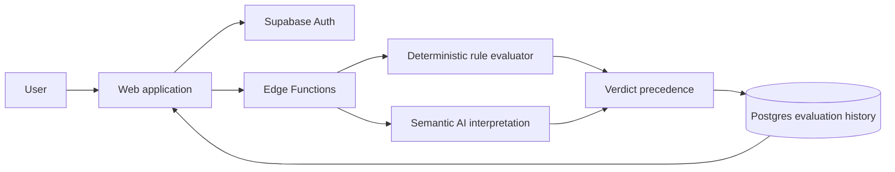

# DriftGuard Case Study

## 1. Problem

Consequential work often fails through constraint drift rather than total misunderstanding. The original purpose is known, but individual outputs gradually violate requirements, omit evidence, or weaken a non-negotiable rule. Existing review is usually late, memory-dependent, and inconsistent.

## 2. User and context

DriftGuard is designed for technical leads, product owners, consultants, founders, and operators who must review work against explicit requirements before it is accepted, shipped, or used as the basis for another decision.

The current repository demonstrates the product and engineering system. It does not claim a completed external pilot or production adoption.

## 3. Existing workflow

1. Requirements are distributed across documents, tickets, and discussion.
2. A reviewer reconstructs the relevant constraints manually.
3. Structured and semantic requirements are mixed together.
4. Reviewers apply different interpretations or overlook missing evidence.
5. The output is accepted, revised, or blocked without a durable record of the exact policy snapshot used.

## 4. Constraints

- The user retains ownership of purpose and guardrails.
- Missing evidence must never be treated as compliance.
- A model must not override explicit blocking rules.
- Every cloud verdict must be traceable to the accepted constraint set.
- Credentials, model access, and privileged writes remain server-side.
- Local fallback must not be misrepresented as authenticated AI judgment.

## 5. Product response

DriftGuard converts an accepted constraint set plus supplied evidence into one of three bounded verdicts:

- `Pass`: every active rule is met.
- `Watch`: at least one rule is unclear or non-blocking evidence is unresolved.
- `Block`: a violated blocking rule is present.

It also returns the smallest correction for the highest-priority unresolved rule.

## 6. Core workflow

1. Enter purpose, workflow, target, and observable proof.
2. Review or edit proposed guardrails.
3. Submit work and evidence.
4. Evaluate binary, threshold, and checklist rules deterministically.
5. Use AI only for bounded semantic interpretation.
6. Apply deterministic precedence to produce the final verdict.
7. Preserve the constraint snapshot for authenticated evaluations.

## 7. Architecture

## 8. Important decisions

### Deterministic enforcement owns the final verdict

A model may classify semantic evidence, but it cannot weaken a blocking rule or convert missing proof into a pass.

### Missing evidence becomes `Watch`

The system chooses conservative uncertainty rather than optimistic completion.

### User acceptance precedes guardrail use

AI-generated guardrails are proposals only; the user owns the policy.

### Local fallback is labelled `rules-preview`

The product remains demonstrable without cloud services, but local output is not represented as cloud-audited AI evaluation.

### Evaluation history is server-authored

The browser cannot author or alter evaluation records.

## 9. Evaluation

A reproducible local benchmark now covers 24 authored binary, threshold, checklist, evidence, mixed-rule, missing-proof, privacy-marker, and unsupported-claim scenarios.

Measured result:

- expected verdict agreement: **24/24**;
- critical false passes: **0**;
- false blocks: **0**;
- unsupported passes prevented versus the declared ungated baseline: **17**.

See `docs/EVALUATION_REPORT.md` and `evaluation/results.json`.

## 10. Proof boundary

The repository demonstrates a functioning core workflow, deterministic precedence, security boundaries, release checks, deployment instructions, and a reproducible authored-scenario benchmark.

It does **not** yet demonstrate:

- real-user adoption or repeat use;
- independently adjudicated semantic accuracy;
- improved business outcomes or errors prevented;
- production reliability or hosted tenant isolation;
- time, cost, or ROI improvement.

## 11. Next justified step

Run three observed sessions with operators reviewing one recent non-sensitive consequential output. Capture completion, time to first verdict, accept/correct/override behavior, suspected false passes or blocks, and whether the verdict changed or confirmed the intended action.
